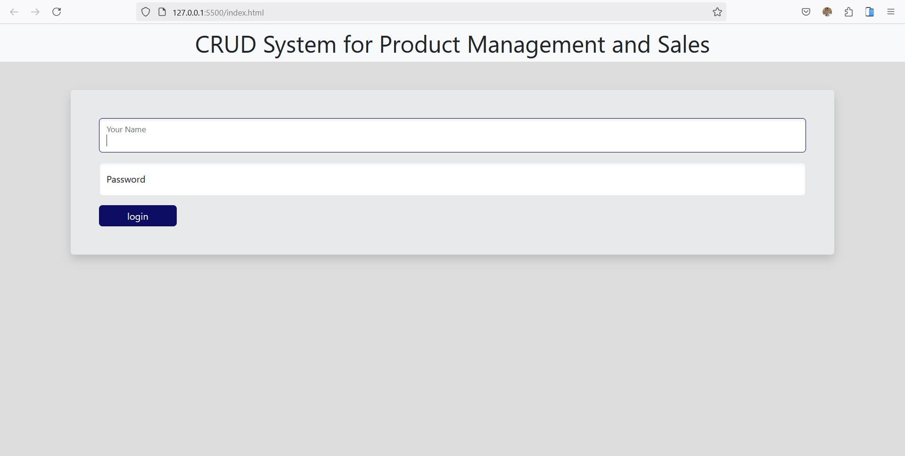
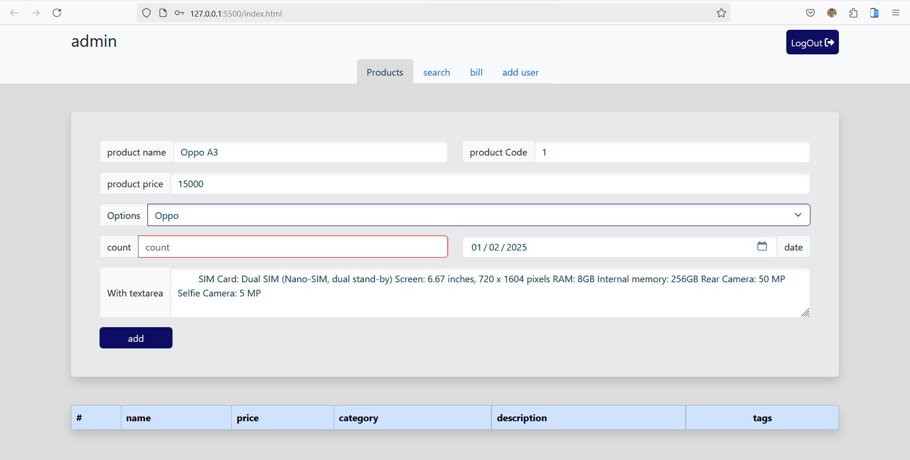
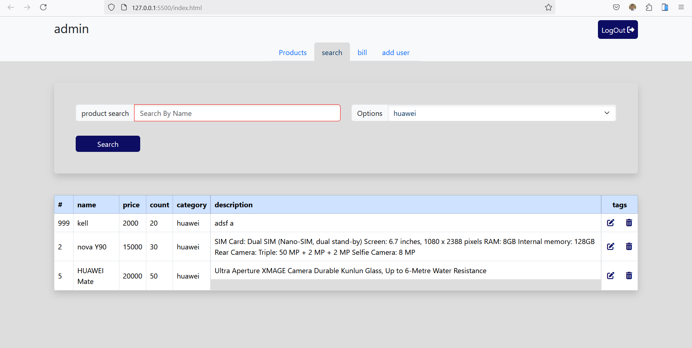
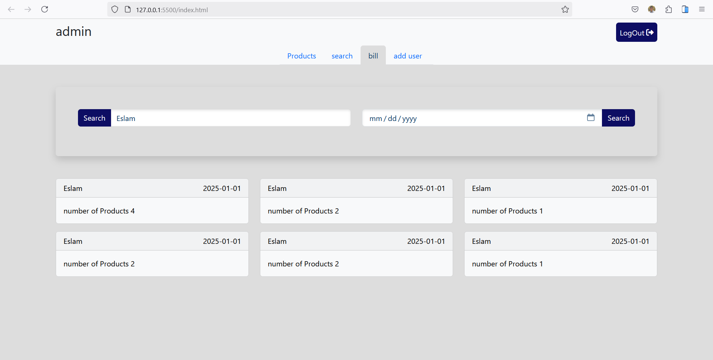
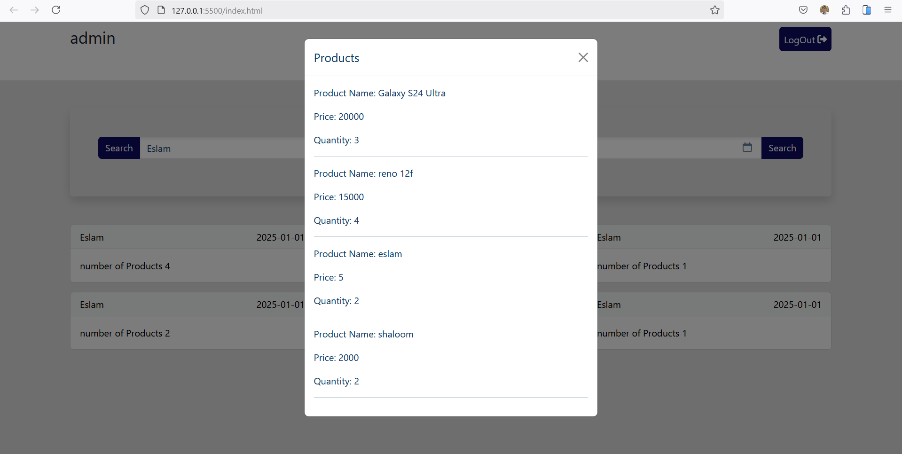
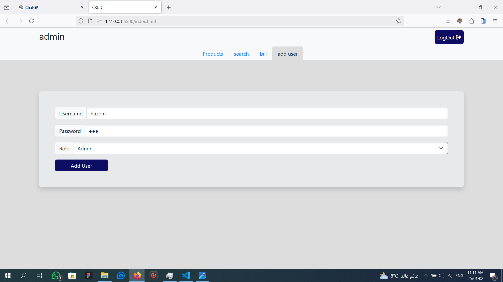
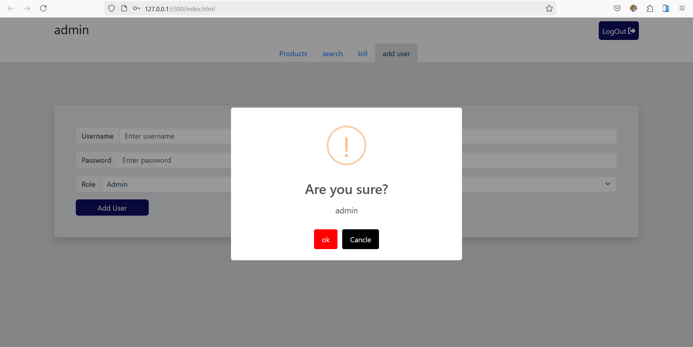
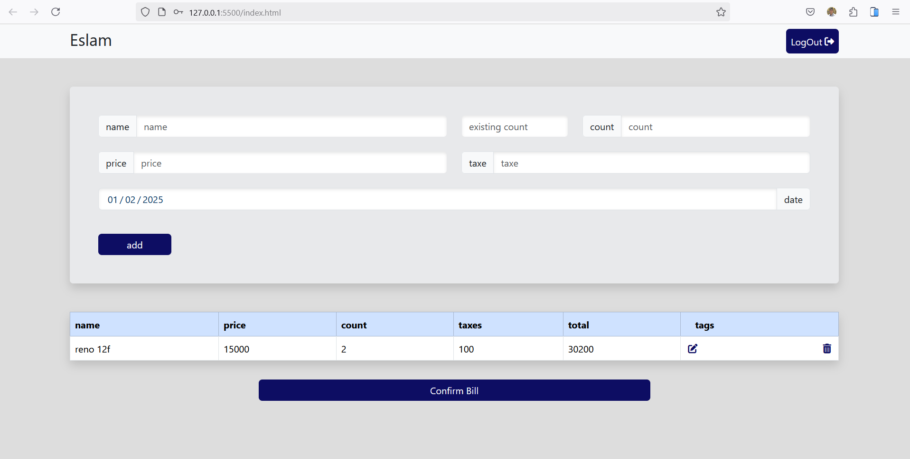

# Project Overview

This project is a comprehensive system designed to manage users, products, and bills using a clean and structured Object-Oriented Programming (OOP) approach. The system is built with JavaScript and leverages local storage for data persistence. Below is an overview of the key components and functionalities:

## Key Features

### 1. User Authentication

- **Login:** Users can log in using their username and password. The system validates the credentials and assigns roles (admin/user) accordingly.
- **Add User:** Admins can add new users with a username, password, and role. The system checks for existing usernames to avoid duplicates.
- **Logout:** Users can log out, which clears their session and resets the UI.

### 2. Product Management

- **Add Product:** Admins can add new products with details such as name, code, price, category, count, and description. The system validates the input fields and ensures the product code is unique.
- **Update Product:** Admins can update existing product details.
- **Delete Product:** Admins can delete products from the system.
- **Search Products:** Users can search for products by name or category.

### 3. Bill Management

- **Add Bill:** Users can create bills by selecting products, specifying quantities, and adding taxes. The system calculates the total price.
- **Update Bill:** Users can update existing bills.
- **Delete Bill:** Users can delete bills from the system.
- **Save Bill:** Bills can be saved to local storage for future reference.
- **View Bills:** Users can view bills by username or date.

### 4. Data Validation

The system includes a robust validation mechanism to ensure that all inputs meet the required criteria before processing.

### 5. Session Management

The system uses session storage to keep track of the active user and their role, ensuring that users only have access to the functionalities relevant to their role.

## Code Structure

The project is structured using OOP principles, with each major component encapsulated in its own class:

### 1. StorageManager

Handles all interactions with local storage, including loading and saving data for users, products, and bills.

### 2. IsValid

Contains validation methods for various input fields, ensuring data integrity.

### 3. AuthSystem

Manages user authentication, including login, adding new users, and handling user roles.

### 4. Products

Manages product-related operations, including adding, updating, deleting, and searching for products.

### 5. BuyProducts

Manages bill-related operations, including creating, updating, deleting, and saving bills.

### 6. BillContainer

Handles the display and filtering of bills by username or date.

## Clean Code Practices

- **Modularity:** Each class has a single responsibility, making the code easier to maintain and extend.
- **Encapsulation:** Data and methods are encapsulated within classes, reducing the risk of unintended side effects.
- **Reusability:** Common functionalities, such as data validation and storage management, are abstracted into reusable classes.
- **Readability:** The code is well-commented and follows consistent naming conventions, making it easy to understand.

## How to Use

1. **Login:** Use the login form to access the system. Default credentials are provided for admin and user roles.
2. **Add/Manage Products:** Navigate to the product management section to add, update, or delete products.
3. **Create Bills:** Use the bill management section to create and manage bills.
4. **View Bills:** Use the bill container to view bills by username or date.

## Conclusion

This project demonstrates the power of OOP in creating a structured, maintainable, and scalable system. By adhering to clean code practices, the project ensures that the codebase is easy to understand, extend, and maintain. Whether you're managing users, products, or bills, this system provides a robust solution for your needs.

## 📷 **Previews:**

1. **Login as Admin or user:**
   

2. **Add Product Interface:**
   

3. **Search about Products:**
   

4. **To Show Bill:**
   
   

5. **Add user:**
   
6. **Logout:**
   
6. **Buy products:**
   